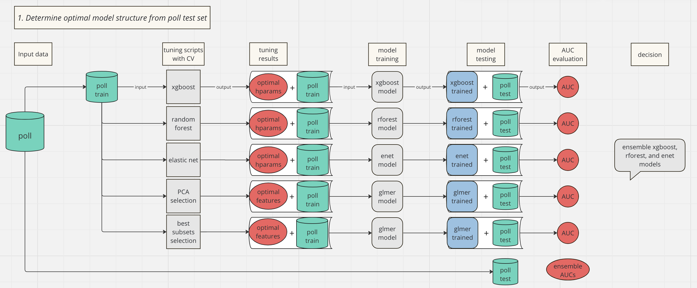

## Ensemble Baysian Model Averaging (EBMA) for Heat Downscaling 

## Project background 
This is a new YPCCC approach to a classic Multilevel Regression with Poststratification (MRP)
problem by building 5 machine learning models to make MRP predictions. To improve 
our final predictions, we take a weighted average of the predictions made by each 
individual model as our final predictions. This is done both manually and with 
an EBMA model, which is a model that selects optimal weights for each model. 

## File organization 
All files are organized into 3 folders: **scripts, temp, and output**

### Input data
The input data includes state and county-level poll and sociodemographic data frames: poll_county, df_county, poll_state, and df_state. These data frames are located in `ypccc_hazards/downscale/all/output` and are created by scripts in `ypccc_hazards/downscale/all`
which creates the input data for all hazards models. 

### Scripts
Contains all scripts used for the project.

### Temp
Contains data that is temporarily needed to produce output of interest. 

### Output
Contains all output including exploratory data analysis plots and model output. 

## Models tested

- Random Forest for MRP
- XGBoost for MRP
- Lasso for MRP
- PCA for selection and glmer for MRP 
- Best subset for selection and glmer for MRP

